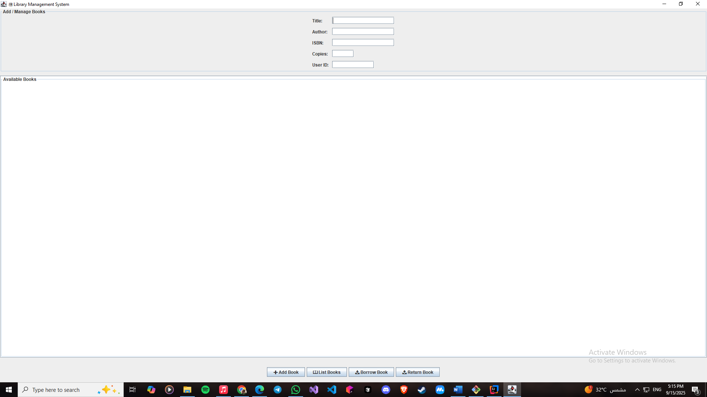
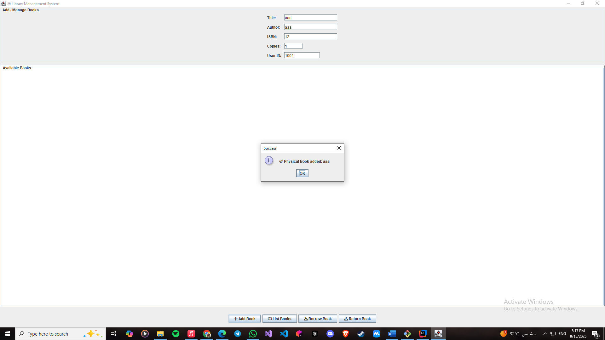
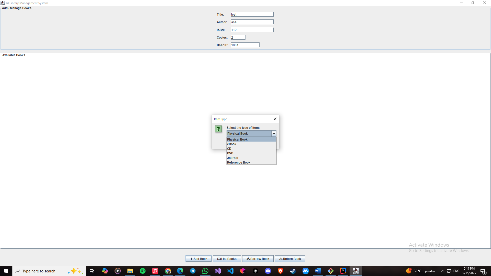
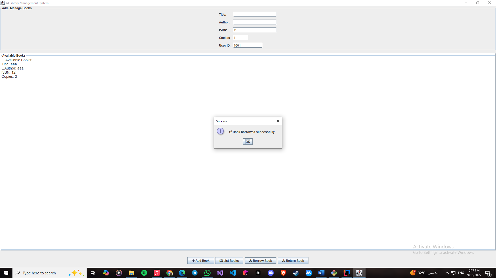
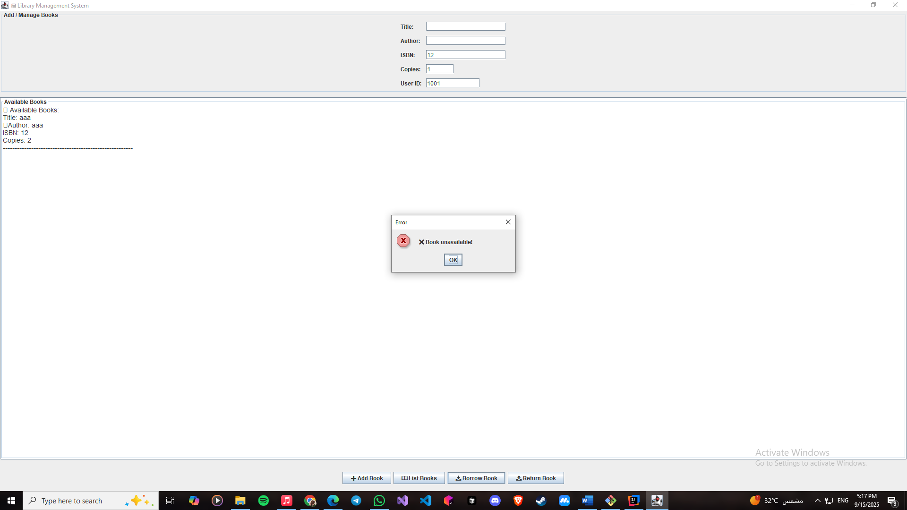

# Library-management-system
A Java Swing-based Library Management System that provides a user-friendly GUI for performing core library operations such as managing books, members, and borrowing/returning records.

# System Features
• Item Management: Supports 6 item types (Physical Books, eBooks, Reference Books, CDs, DVDs, Journals)

• Borrowing System: Implements different borrowing rules per item type, preventing non-borrowable items from beign borrowed

• GUI Interface: Interactive forms for all operations

• Inventory Tracking: Maintains available quantities of each item

# System Functions

1- Add item

2- Borrow item

3- List Available Items

4- Return item

# System Sample ScreenShots

